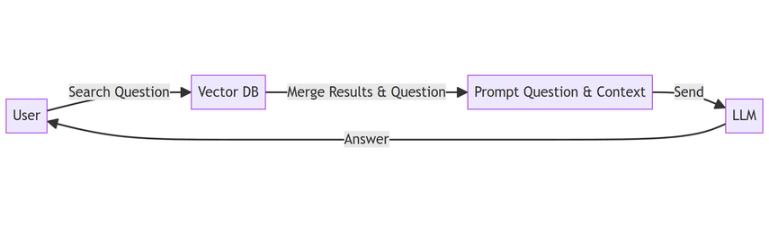

### RAG Playground

#### Retrieval-augmented generation (RAG) 

is a technique for enhancing the accuracy and reliability of generative 
AI models with facts fetched from external sources.





Build the containers - `rag` with python dependecies and `qdrant` with the vector database

```sh
make build
```

Download the models with [huggingface](https://huggingface.co/docs/hub/en/models-downloading) or clone them

- [TinyLlama-1.1B-Chat-v0.6](https://huggingface.co/TinyLlama/TinyLlama-1.1B-Chat-v0.6)
- [facebook/bart-large-cnn](https://huggingface.co/facebook/bart-large-cnn)


Import data into the collection:


```sh
make import
```

Qdrant collection [Dashboard](http://0.0.0.0:6333/dashboard#/collections)


Answer the question using a language model ([TinyLlama-1.1B-Chat-v0.6](https://huggingface.co/TinyLlama/TinyLlama-1.1B-Chat-v0.6))

```sh
make ask q="What are the prices for Honor Magic6 Pro? Tell me only the final prices."
```

```sh
The final prices for the Deals listed in the given text material are as follows:

- DEAL Honor Magic6 Pro + Honor Pad 8 + Earbuds X6 + 100W Supercharger - £29.99pm/24 + £349 Upfornt (£5 TCB) for 1078.76.
- DEAL Honor Magic6 Pro on contract with ID Mobile (3)Upfront £119.00Monthly £39.99100gb DataUnlimited MinsUnlimited TextsIncluded free gifts:Honor Pad 8Honor Earbuds X6Honor 100W ChargerOther contracts are available for example Upfront £49.00Monthly £42.99Which works out a few pence more with a lower upfront cost100gb DataUnlimited MinsUnlimited Texts
```

```sh
make ask q="How much is Mario vs Donkey Kong?"
```

```sh
The price of Mario vs Donkey Kong (Nintendo Switch) is £31.99, including free delivery at Currys.

```


Summarize using a summarization model ([facebook/bart-large-cnn](https://huggingface.co/facebook/bart-large-cnn))

```sh
make summarize q="Cooking and food?"
```

```

The Ninja Foodi MAX 9-in-1 Multi-Cooker makes it quick and easy to cook delicious meals, sides, snacks and desserts. 
9 cooking functions, a large 7.5L capacity and Ninja’s exclusive TenderCrisp Technology. 
Pressure cook food up to 70% faster than traditional cooking methods.

```
